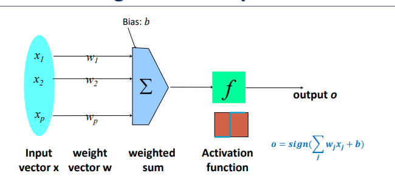
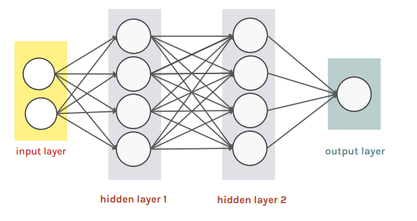
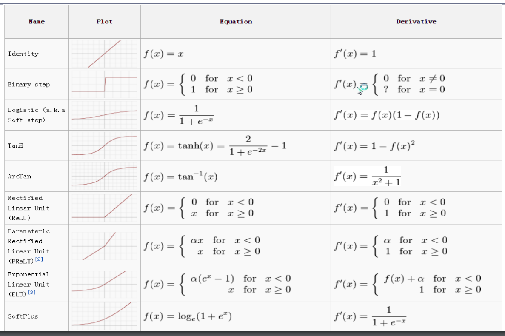
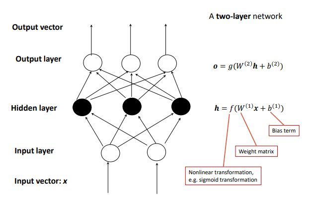
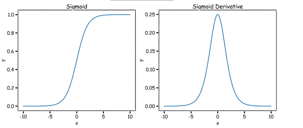

# Lecture 10
## Perceptron
- 
    - The activation function can be *generalized* to change the behavior of the perceptron
- 
## Architecture
- The architecture of a neural network is just the **network topology**, which is related to the number of units in the input layer, the number of hidden layers, the number of units in each hidden layer (if any), connections between layers, and the number of units in the output layer
    - This boils down to what maps the *input* to the *output* - so all the neurons and weights in between
## Activation Function
- The activation function controls the nature of the output of a layer (or output layer) of a neural network
- Activation functions bring *nonlinearity* into the hidden layers, which increases the complexity of the model
    - It should be noted, though, that feasible activation functions should be *differentiable*
- 
    - ReLU is most commonly used, as it has a *constant gradient* which avoids the issue of vanishing gradients
## Loss Functions
- The **loss function** of a neural network relates how good the predicted outputs are compared to the labels (target)
    - $L(w) = \frac{1}{n}\sum_i l(y^{(i)}, \hat{y}^{(i)})$, where $\hat{y}^{(i)}$ is the output of the neural network for $x_i$
- Common Loss Functions:
    - Squared Error: $l(y, \hat{y})=(y-\hat{y})^2$
    - Cross Entropy Loss: $l(y, \hat{y})= -y \log{\hat{y}} - (1 - y)\log{(1-\hat{y})}$
    - Hinge Loss: $l(y, \hat{y})= \max(0, 1 - y \hat{y})$
- With this loss, the empirical risk is minimized - this is done via *gradient descent*
    - For a multi-layered neural network, calculating the gradient involves making use of the *chain rule* to compute the gradient for the parameters of each layer - this is known as **backpropagation**
## Connection to Shallow Machine Learning Algorithms
### Perceptron as Support Vector Machine
- A perceptron is just a *single neuron*
- It can be shown that the linear support vector machine is similar to the perceptron with regularization and with an identity activation during training (and sign function activation druing training)
    - The loss function of the perceptron is $l(y, \hat{y}) = \max{(0, -y \hat{y})}$, which is similar to the *hinge loss*, $l(y, \hat{y}) = \max{(0,1 -y \hat{y})}$ with regularization on the weights $\frac{1}{2}\lambda ||w||^2$
    - The support vector machine will have a wider margin compared to the perceptron due to the loss function having the $1 - y \hat{y}$ term
### Perceptron as Logistic Regression
- A perceptron with a single neuron and a sigmoid activation function can also be shown to be similar to logistic regression
    - The loss function will be the binary cross entropy loss: $l(y, \hat{y})= -y \log{\hat{y}} - (1 - y) \log{(1 - \hat{y})}$
### Multivariate Logistic Regression
- Multivariate regression can be achieved using *multiple neurons* - $C$ output neurons, where $C$ is the number of classes
    - The *softmax* activation function is used: $P(y = i | x) = \frac{e^{w_i x}}{\sum_j^C e^{w_jx}}$
## Feedforward Networks
- 
    - The input layer is not counted towards the number of layers - only the hidden layers and output layers count
- Combining neurons via chained layers allows for interesting functions to be modeled - the combination of non-linear functions allows for more complex, robust functions to be modeled
    - Non-linear functions can allow for the data to be transformed in a representation that allows for prediction to be performed - e.g. a set of data points can linearly separated after passing through the neural network
## Neural Network Design
### Activation Functions
- Sigmoid: $y = \frac{1}{1+e^{-x}}$
    - 
    - A downside of the sigmoid activation function is that its derivative is close to zero for much of its domain, which leads to a *vanishing gradient* during backpropagation
- ReLU: $y = \max{(0, x)}$
    - An advantage of the ReLU function is that it does not suffer from vanishing gradient when $x > 0$
    - Another advantage is that it provides *sparsity* given that $y = 0$ when $x < 0$
        - This acts as a regularization strategy
- Leaky ReLU: $y = \max{(0, x)} + \alpha \min{(0, x)}$, where $\alpha$ is generally small
    - This fixes the issue of dying ReLUs by ensuring the derivative is non-zero everywhere
- Softplus: $y = \log{(1 + e^x)}$
    - This is a smooth approximator of the ReLU
### Loss Functions
- Loss functions are defined over a single data point, but are averaged over the *entire dataset* - this is the **empirical loss**
    - The loss over the dataset (or a mini batch) is differentiated with respect to the parameters of the model
- Types of Loss Functions:
    - Squared Error: $l(y, \hat{y}) = (y - \hat{y})^2$
    - Binary Cross Entropy: $l(y, \hat{y}) = -y \log {\hat{y}} - (1 - y)\log{(1 - \hat{y})}$
    - Hinge: $l(y, \hat{y}) = max(0, 1 - y \hat{y})$
### Output Units
- For binary classification, it is necessary for the output unit to model the probability that $y = 1$
    - This can be done with the sigmoid function: $P(y=1) = \frac{1}{1 + e^{-\phi(X)}}$, where $\phi(X)$ is the result of the input after being passed through all previous (hidden) layers
- For multiple classification, the output unit should model the probability of *each class*, and this can be done via the softmax activation
    - $P(y = k) = \frac{e^{\phi_k(X)}}{e^{\sum_{j=1}^K \phi_j(X)}}$
- For regression, the output should be a *linear unit* since the goal is to predict a continuous number
## Training a Neural Network
- Training a neural network involves starting with all randomly selected weights, but then refining those weights via **gradient descent**
    - The derivative of the loss function can be taken with respect to these weights, and then these weights can be updated as to reduce the loss function based on the gradient
        - Optimally, one should look for the weights where $\frac{dL(W)}{dW} = 0$
        - $w^{t+1} = w^{t} - \lambda \frac{dL}{dw}$
    - Stochastic gradient descent is commonly used, where the gradient is based on a *small batch* of the data points, rather than the entire dataset
- The process of actually computing the gradient for a neural network is done through the **backpropagation** algorithm, which leverages the chain rule to calculate the gradient
    - Since each layer applies a function to the output of the previous, the chain rule is necessary
## Practical Issues
- Fitting a deep neural network can lead to good prediction on the training set but poor prediction on the validation set - this is a sign of **overfitting**
    - One way to address this is to apply norm penalties (e.g. L1 or L2 regularization): $L_R(W ; X, y) = L(W ; X, y) + \alpha \Omega(W)$
- Another way to regularize involves performing **early stopping**, where the training is stopped after the validation accuracy stops increasing (or alternatively, the validation loss stops decreasing)
- **Dropout** is another form of regularization, where neurons are randomly *dropped* during training to promote a more robust model
## Deep Learning
- Deep learning leverages networks with *many layers*, and make use of various architectures - typically those that involve parameter sharing
    - Examples include convolutional neural networks and recurrent neural networks