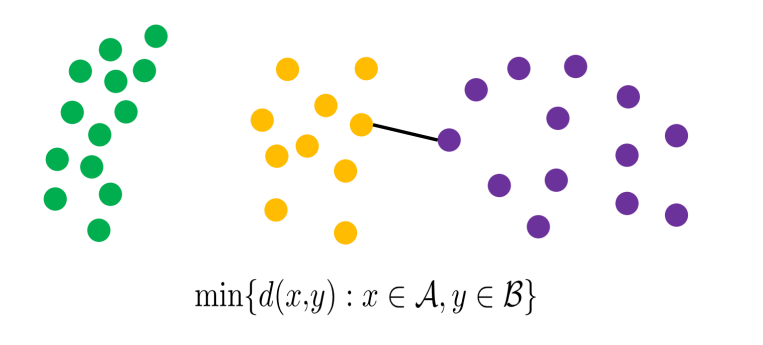
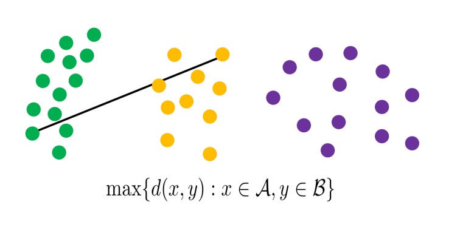
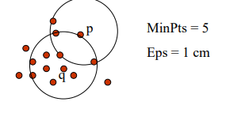
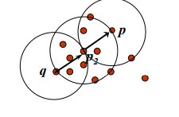
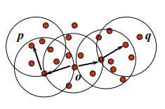
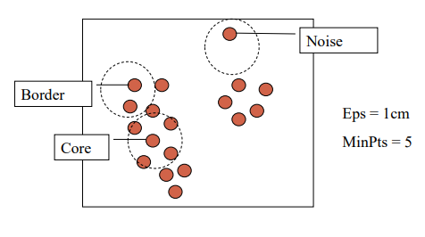
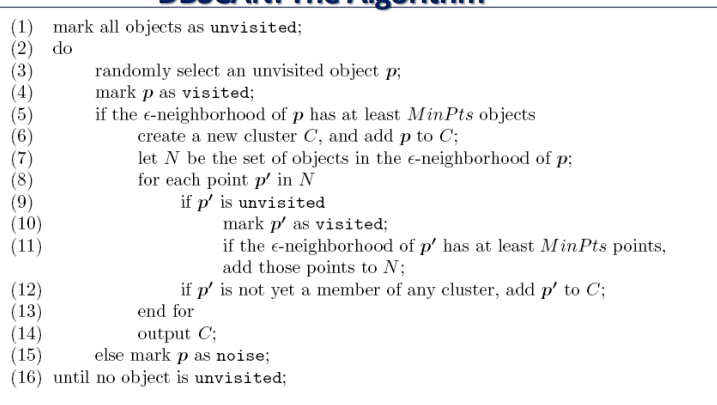

# Lecture 11
## Cluster Analysis
- A **cluster** is a collection of data objects
    - Similar data points should be within the same group whereas dissimilar objects should be in other groups
- **Cluster analysis** involves finding the similarities between data according to their characteristics and grouping them into clusters
    - Cluster analysis is typically **unsupervised** - there are no predefined classes, but rather the representations of data is learned
### Applications
- Cluster analysis can be used to perform **data reduction**, as it can allow for data to be summarized according to their clusters or to be compressed
- Cluster analysis can also be used to make *predictions* based on groups
## Partioning Methods
- A **partitioning method** partitions a dataset $D$ of $n$ objects into a set of $k$ clusters, such that the sum of squared distances is minimized:
    - $J = \sum_{j=1}^k \sum_{C(i)=j} d(x_i, c_j)^2$
        - $c_j$ is the centroid of cluster $C_J$
        - The outer sum is going through all $k$ clusters, and the inner sum is taking the distance of each datapoint *in that* cluster and the centroid of the cluster
- Given a $k$, the goal is to find a partition of $k$ clusters that optimizes the partitioning criterion
    - A naive way to do this is to enumerate all possible partitions, but more practical approaches utilize heuristics
### K-Means Clustering Method:
- Steps:
    - Partition objects into $k$ non-empty subsets
    - Compute seed points as the centroids of the clusters of the current partioning
    - Assign each object to the cluster with the nearest seed point
    - Go back to the second step (center calculation) and stop when the assignment does not change
- Essentially, what is being done is that centroids are initially seeded, but as objects are added to their respect cluster based on closeness to the centroid, these centroids will *change*
    - As these centroids change, the nearest cluster for each object will also change, so the process will repeat until convergence
### Hierarchical Methods
- **Hierarchical clustering** involves using the *distance matrix* as clustering criteria building up (or breaking down) clusters
    - Bottom-up: Each object is assigned into their own cluster, and then clusters are *combined* until a stopping condition is reached
    - Top-down: All objects are in a single cluster, and clusters are *split* until a stopping condition is reached
    - This approach does not require specifying a value of *k* for the number of clusters
- Pseudo Code:
    - Place each data point into its own cluster and compute the distance matrix between clusters (each entry [i][j] has the distance between cluster i and cluster j)
    - Repeat all the data are merged into a single cluster or a specified number of clusters is reached:
        - Merge the two closest clusters (smallest entry in the matrix)
        - Update the distance matrix for all affected entries
- How the *similarity* is defined between clusters is a hyperparameter:
    - Single-Linkage: $min[d(x,y): x \in A, y \in B]$
        - 
    - Complete-Linkage: $max[d(x,y): x \in A, y \in B]$
        - 
    - Average Linkage: $\frac{1}{|A| \cdot |B|} \sum_{x \in A} \sum_{y \in B} d(x, y)$
### DBSCAN
- **Density-Based Clustering methods** involve clustering based on *density*, a local cluster criterion
    - The goal is to discover clusters of arbitrary shape - while handling any noise - in *one pass*
    - It is necessary to specify some density parameters as the termination condition
- **DBSCAN**:
    - Parameters:
        - Epsilon: The maximum radius of the neighborhood
        - Min-Points: The minimum number of points in an epsilon neighborhood of that point
    - Definitions:
        - $N_{eps}(q) :$ {q belongs to D | dist(p, q) $\leq$ epsilon}
            - $q$ is a core point if $|N_{Eps}(q) \geq MinPoints|$
        - A directly density-reachable point $p$ with respect to $q$ is one where $q$ is a **core point** and $p$ belongs to $N_{Eps}(q)$
            - 
        - A density-reachable point $p$ with respect to $q$ is one where there is a *chain* of points $p_1, ..., p_n$ such that $p_1 = q$ and $p_n = p$ and $p_{i + 1}$ is directly density reachable from $p_i$
            - 
        - A density-connected point $p$ with respect to $q$ is one where is a point $o$ such that both $p$ and $q$ are density-reachable from $o$
            - 
    - DBSCAN defines a cluster as a *maximal set of density-connected points*
        - Any object not contained in a cluster is *noise*
        - 
            - The border points do not have enough points (with respect to MinPts) to form a radius
    - 