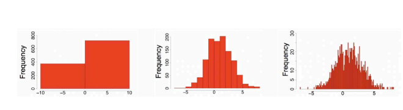

# Lecture 2
## Vector Data
- Tabular data can be thought of as a *matrix* of dimension $n \times p$, where there are *n* data points and *p* features
- The attributes (features) themselves can be *numerical* or *discrete*
- Discrete variables can be further classified:
    - *Nominal*: THe different categories cannot be compared (e.g. hair color or marital status)
    - *Binary*: There are only two possible outcomes (e.g. gender)
    - *Ordinal*: Values have a meaningful order, but the *magnitude* between sucessive values is not known (e.g. small, medium, large sizes)
## Data Exploration
- A set of data points is a *sample* from a *population*
    - The population is the entire set of objects or events under study (e.g. *all people in LA*)
    - The sample is a *representative* subset of the objects or events under study, as it is typically impossible to operate under the entire population
- Biases can occur from sampling
    - **Selection bias**: Some subjects or records are more likely to be selected
    - **Nonresponse bias**: Subjects or records who are not easily available are not represented
### Descriptions of Data
- Central Tendency: Mean (sample versus population), median, mode
    - Mean is sensitive to outliers (skew): mean > median implies positive (right) skew; mean < median implies negative (left) skew
    - For categorical variables, the mean or median do not make sense - the mode makes most sense
- Dispersion: Quartiles, inter-quartile range, five number summary, outliers
- Variance: Range, variance, standard deviation
    - Variance and standard deviation is sensitive to outliers
    - Standard deviation is preferred to variance because it has the same units as the underlying data
### Visualization of Data
- Summary statistics alone cannot indicate everything about the data - visualizations are typically necessary
    - **Distribution**: How a variable distributes over a range of values
    - **Relationship**: How values of multiple variables relate
    - **Composition**: How the dataset breaks into subgroups
    - **Comparison**: How different trends in variables compare
- **Histogram**: Visualizes distributions (1-dimensional) for numerical variables
    - 
- **Pie Chart**: Visualizes distributions for categorical variables
    - 
- **Scatter Plot**: Visualizations relationship between two different attributes of multi-dimensional data
    - 
    - Positive or negative **linear** correlations can be determined from these plots
    - If there are multiple variables, then a scatterplot matrix can be determined (between each possible variable pair)
- **Stacked Area Graphs**: Show trends over time (relates a categorical variables to a quantitative variable, which is time)
    - 
- **Boxplots**: Visualize trends such as median, quartiles, and so forth, over different variables
- For complex variables (high dimensional), it can be hard to create proper visualizations
    - Even if high dimensional data can be visualized, it may be hard to interpret as compared to two dimensional visualizations
    - Three dimensional data can be visualized in a two dimensional manner using color, bubble sizes, and other types of techniques
### Data Preprocessing
- It may be necessary to **preprocess** data, as for cases where there is *missing data* (drop the row or replace the value with the mean/median), dealing with *outliers* (drop the row)
    - Outliers can be identified as being outside 1.5 times the IQR of Q1 or Q3; alternatively, an outlier is a value beyond three standard deviations of the mean
-       # Filter data to remove outliers or missing values
        import pandas as pd
        df = pd.read_csv('data.csv')
        condition1 = df['price'] >= 10
        condition2 = df['beds'].isnull()
        df_filter = df[condition1 & ~condition2]
### Data Transformations
- New features can be added to data based on existing features - this is known as *feature engineering*
    - E.g. living area per bed = living area divided by number of beds
- Categorical features may also be transformed into numerical features (e.g. binary or one hot encodings)
    - One hot encoding example: `is_red`, `is_blue`, `is_yellow`:
        - Red: `{1, 0, 0}`
        - Blue: `{0, 1, 0}`
        - Yellow: `{0, 0, 1}`
    - One Hot Encoding: `df_binary = pd.get_dummies(df)`
- It may also be necessary to *normalize* features to avoid large ranges (observation space)
    - Z-Score Normalization: $x <= \frac{x - \bar{x}}{\sigma}
    $
        - Most real numbers will be in the range from -3 to 3
    - Min-Max Normalization: $\frac{x - min}{max - min}$
        - All numbers will be in the range [0, 1]