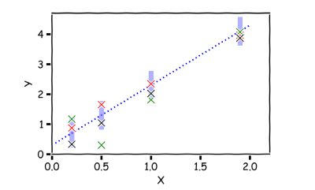
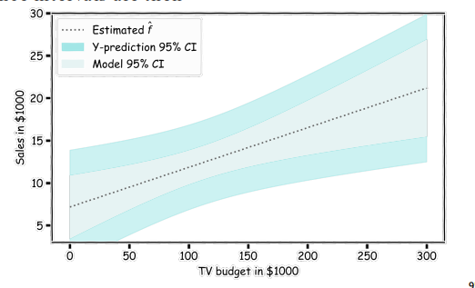
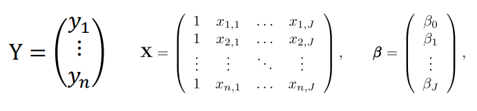
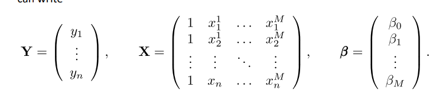

# Lecture 3
- Modeling a dataset is useful as it can lead to tasks such as *prediction*, *classification*, and *clustering*
- Flow:
    - Training: Given a training dataset, learn a model
    - Validation: Use a separate validation dataset to do model selection (hyperparameters)
    - Test: Apply the model to a test dataset to evaluate performance
## Prediction
- With prediction, it can often be important to be able to predict variable using another set of variables
    - e.g. Predicting the amount of views a YouTube video will get based on video length, date posted, previous number of views, and so forth
- Typically, *predictor* feature variables are used to predict *response variables*
### Linear Regression
- Predictor: $f(X) = \beta_1X + \beta_0$
    - $f(x)$ is single dimensional, but $X$ can be of multiple dimensions
    - Since there is *noise*: $Y = f(X) + \epsilon = \beta_1X + \beta_0 + \epsilon$
    - This is the *true* predictor of $Y$
- The estimate of $Y$ is $\hat{Y} = \hat{f}(X) = \hat{\beta_1}X + \hat{\beta_0}$
    - This is the *estimated* predictor based on the observations; the goal is to determined $\hat{\beta}$ that approaches $\beta$
- How well an estimate fits the data can be quantified:
    - First, compute the *residuals*: $y_i - f(x_i)$
    - Then, compute the *mean squared error* of these residuals - this is the loss function
        - $L = \frac{1}{n} \Sigma (y_i - \hat{y_i})^2$
        - $L = \frac{1}{n} \Sigma (y_i - (\beta_0 + \beta_1x_i))^2$
    - The optimal values for $\hat{\beta_0}$ and $\hat{\beta_1}$ are those that satisfy $\argmin_{\beta_0, \beta_1}{L(\beta_0, \beta_1)}$
- The regression coefficients can be learned in a variety of ways:
    - One way is to *brute force* various lines, determining which is the best according to the afformentioned loss function
    - Another way is to find the *exact solution* using optimization techniques
        - Take the *partial derivatives* of the loss function with respect to the parameters, set it to zero, and find the solution to the equation
        - $\hat{\beta_1} = \frac{\Sigma(x_i - \bar{x})(y_i - \bar{y})}{(x_i - \bar{x})^2}$
        - $\beta_0 = \bar{y} - \hat{\beta_1}\bar{x}$
    - Sometimes, finding the exact solution may not feasible hence the need for *gradient descent* - an iterative method
        - Start from a random point, compute the gradient, move to the *opposite direction* of the gradient (to reduce the loss), and repeat until convergence or a low enough loss is reached
        - $\beta^{new} = \beta^{old} - \lambda \frac{dL}{d\beta}$
        - Full Batch: Utilize *all* data to calculate the loss (and therefore its gradient)
            - This approach is typically computationally slow since *every single data point is used*
        - Stochastic Gradient Descent: Use *single* data points to calculate the loss (and therefore its gradient)
            - This approach is much faster but is *very noisy*
        - Mini-Batch Gradient Descent: Uses a small *batch* of observations to calculate the loss (and  therefore its gradient)
#### Confidence Intervals for Predictor Estimates
- Interpredicting predictors ($\beta$) depends on the values themselves, but the decisions *based on these predictors* depend on how much we can *trust* them - that is, how reliable the predictors are
- Recall that the true value $y$ can be expressed in terms of a *true* function and some *noise*: $y = f(x) + \epsilon$
    - If $f(x) = \beta_0 + \beta_1x$ is known exactly and there is *no noise*, then estimating $\hat{\beta}$ would be *exact*
- However, there are various complications associated with the estimators $\hat{\beta}$:
    - There is the noise $\epsilon$
        - This is the measurement error or *irreducible error*, since the noise is *always there*
        - Every time a response *Y* is measured for a fixed value of *X*, there will be some variance and hence a different estimate of $\hat{\beta}$
    - The exact form of $f(x)$ may not be known
    - The sample size may be limited
- 
    - Due to the measurement error, there can be different regression fits ($\hat{\beta_0}, \hat{\beta_1}$)
- If there is only *one set of measurements {X, Y}*, then the estimates $\hat{\beta_0}$, $\hat{\beta_1}$ are just for that particular realization of the measurements
    - If theoretically the same data could measured multiple times (different noise), then the mean and standard deviation over the distribution of $\hat{\beta_0}$ and $\hat{\beta_1}$ estimators could be found
    - A *confidence interval* could be formed, representing the ranges that the *true* value of the estimator is contained within the interval with *n* percent probability
#### Bootstrapping
- Bootstrapping attempts to find the mean and standard deviation of an estimator by *sampling* the observed data (with replacement) and repeating the process
    - E.g. Compute $\hat{\beta_0}$ and $\hat{\beta_1}$ multiple times by randomly sampling the dataset, and then using the variance and mean of these estimates to approximate the true $\beta_0$ and $\beta_1$
    - **Standard Error**: $SE(\hat{\beta}) = \sqrt{var(\hat{\beta})}$
        - Standard deviation is the variability within a *single sample* whereas standard error is the variability across *multiple samples*
- How significant a predictor can be computed as $\frac{mean}{standard \ error}$
    - A higher valued predictor is significant, but also one that fluctuates less *lower standard error*
#### Regression Confidence Intervals
- 
    - Since different realizations of the estimators produce different regression lines, there is a distribution (mean and standard deviation) of $\hat{f}$ for *each value of x*
        - A confidence interval for each $\hat{f}$ could be computed
    - There is a confidence interval associated with the model $f$ as well as for the true value $y$ (recall there is measurement noise)
        $y \sim N(f, \sigma_\epsilon) $ 
- Computing confidence intervals: Determine the mean and standard error
    - 95%: mean +/- 2 std
    - 68%: mean +/- 1 std
    - 99%: mean +/- 3 std
### Multi-Variate Linear Regression
- For multiple features predicting a single response variable, a model might take the form: $\hat{y} = \hat{f}(x_1, x_2, ... x_J) = \hat{\beta_0} + \hat{\beta_1}x_1 + ... + \hat{\beta_J}x_J + \epsilon$
- This can be *vectorized*: $Y = X\beta + \epsilon$
    - 
        - The column of 1's allows for the coefficient to be accounted for
    - $MSE(\beta) = \frac{1}{n}||Y-XB||^2$
        - Using vector calculus: $\hat{\beta} = (X^T X)^{-1}X^TY$
- In higher dimensions, the regression model corresponds to a plane (two-dimensional features) or hyperplane (more than two diimensions)0
### Qualitative Predictors
- If predictors are *qualitative* rather than *quantitative*, they can be converted into quantitative predictors via one-hot encodings or indicator variables
    - E.g. $x_i$ = 0 if the *ith* person is male and $x_i$  = 1 otherwise
### Polynomial Regression
- If there is an interaction between two predictors, then this can be included in the model:
    - E.g. $Y = \beta_0 + \beta_1X_1 + \beta_2X_2 + \beta_3X_1X_2 + \epsilon$
- Polynomial regression:
    - $y = \beta_0 + \beta_1x + \beta_2x^2 + ... + \beta_mx^m \epsilon $
    - 
        - $Y = X\beta + \epsilon$
        - $\hat{\beta} = (X^T X)^{-1}X^T Y$
    - If the underlying data is polynomial, this can be a better model - but in other cases this can *overfit*