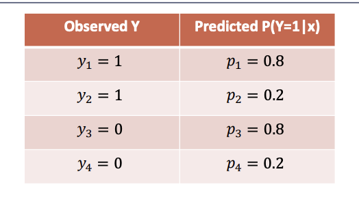

# Lecture 5
## Classification
- **Classification** involves predicting a **categorical** response variable - this is different from regression which involves predicting a numerical response variable
- Attempting to solve classification using regression techniques is not feasible
  - Although the categorical response variable could be encoded into a quantitative variable, a regression model does not fare well since classification targets are *not ordinal* or even comparable 
  - Even in the binary case, a regression line can result in non-sensible values for *y* (which should only take values of 0 or 1)
## Binary Classification
- For two classes, labeled as 0 and 1, the probability can be modeled as two outcomes: $P(y=0 |x)$ and $P(y=1 | x)$
  - $P(y=0|x) = 1 -P(y=1|x)$
    - Given this relationship, there is only a need to model one of the probabilities (e.g. $P(y = 1 |x)$)
  - If $P(y=1|x) > 0.5$, classify the data point into class 1 and otherwise class 0
- In binary classification, the *logistic function* can be used to model the class probability
  - 
  - $\sigma(x) = \frac{1}{1 + e^{-x}}$
- **Logistic Regression** estimates $P(Y = 1)$ by modeling a logistic function
  - $P(Y = 1) = \frac{e^{\beta_0 + \beta_1X}}{1 + e^{\beta_0 + \beta_1X}} = \frac{1}{1+e^{-(\beta_0 + \beta_1X)}}$
    - $\beta_0$ refers to where the *center* value of the logistic curve is (the point where $P(Y) = 0.5$)
    - $\beta_1$ refers to the shape of the curve itself(slope)
  - It can be shown that $\ln(\frac{P(Y=1)}{1 - P(Y=1)}) = \beta_0 + \beta_1X$
    - $\frac{P(Y=1)}{1 - P(Y=1)}$ is the **odds**, and the logistic regression model is known to be the **log-odds** with a linear function of predictors X
      - Increasing X by a single unit results in a $\beta_1$ change in the logg-odds of $Y=1$ or a $e^{\beta_1}$ change in the odds that $Y=1$
      - When $P(Y=1)$, the odds approach infinity (infinite chanceo of Y occurring) and when $P(Y=0)$, the odds are zero (no chance of Y occurring)
## Estimation
- How good a logistic model is can be measured by determining the **likelihood**, which is the product of observing each data point's outcome label
  - 
    - $p_1 \times p_2 \times (1 - p_3) \times (1 - p_4) = 0.0256$
  - Note that likelihood assumes *independence* between data points
- The goal is to estimate the $\beta_0$ and $\beta_1$ parameters that *maximize* the likelihood (this can be done via gradient ascent)
- For a single point: $L(Y_i) = P(Y_i = y_i) = p_i^{y_i} (1 - p_i)^{1 - y_i}$
  - If $Y = 1$, then probability is just $p$
  - If $Y = 0$, then the probability is just $1 - p$
- For an entire *dataset* (of independent observations): $L(Y_{1:n}) = \prod P(Y_i = y_i) = \prod p_i^{y_i} (1 - p_i)^{1 - y_i}$
  - To turn this into a computable *loss* function (so that gradient *descent* can be performed), take the negative log: 
    - $-\log(L_{1:n}) = -\sum (y_i \log p_i + (1-y_i)\log (1 - p_i))$
    - This is actual the *cross-entropy loss*, which is the difference from the predicted distribution $p$ to the ground truth distribution $q$
      - $H(q, p) = - \sum q_k \log(p_k)$
      - Here, $q$ is the distribution of labels ($q_0 = 1$ and $q_1 = 0$ if $y = 0$ and otherwise $q_0 = 0$ and $q_1 = 1$)
      - $p$ is the regression model
  - $l(\beta_0, \beta_1 ; Y_{1:n}) = -\sum (y_i \log \frac{1}{1 + e^{-(\beta_1X_i + \beta_0)}} + (1-y_i)\log (1 - \frac{1}{1 + e^{-(\beta_1X_i + \beta_0)}}))$
- The loss function does not have a *closed form solution*, so instead gradient descent must be used
  - The log-likelihood can be rearranged to: $\log L = \sum (y_i x_i^T \beta - \log(1 + e^{x_i^T \beta}))$
  - $\frac{\partial \log L(\beta)}{\partial \beta_j} = \sum y_i x_{i, j} - \sum \frac{x_{i, j} e^{x_i^T \beta}}{1 + e^{x_i^T \beta}} = \sum y_i x_{i, j} - \sum p_i (\beta) x_{i, j} = \sum x_{i, j}(y_i - p_i(\beta))$
## Multiple Logistic Regression
- If there are *multiple features*, it is still possible to generalize to more predictors
  - Though, keep in mind more features may result in overfitting - so it may be necessary to regularize to avoid this
  - $\log \frac{P(Y = 1)}{1 - P(Y = 1)} = \beta_0 + \beta_1X_1 + \beta_2X_2 + ... + \beta_p X_p$
    - $P(Y = 1) = \frac{e^{\beta_0 + \beta_1X_1 + \beta_2X_2 + ... + \beta_p X_p}}{1 + e^{\beta_0 + \beta_1X_1 + \beta_2X_2 + ... + \beta_p X_p}}$
  - This type of model can be fitted in the same way as with one feature - use gradient descent
## Decision Boundaries
- For *single-feature* logistic regression, the **decision boundary** lies at the data point $x$ where $P(y = 1 | x) = 0.5$
  - For more features, the decision boundary is the line, plane, or hyperplane where $P(y = 1 | X) = 0.5$
- Logistic regression has inherently *linear* decision boundaries, so it works well with "well-separated" data that can be linearly separable
  - If the data is not linearly separable, it may be feasible to first apply a *transformation* to the data such that it can become linearly separable after the transformation (e.g. change of coordinates)
## Multiclass Logistic Regression
- If there are *several* response categories, **multinomial logistic regression** can be performed
- One of the classes can be chosen as the *baseline group*, and the other *K - 1* classes are compared to it
  - $\ln \frac{P(Y = k)}{P(Y=K)} = \beta_{0, k} + \beta_{1, k}X_1 + ... + \beta_{p, k}X_p$
    - Models are built to predict being in class $k$ from class $K$
  - e.g.
    - $\ln \frac{Pr(Y_i = 1)}{Y_i = K} = \beta_1 \cdot X_i$
      - $Pr(Y_i = 1) = Pr(Y_i = K)e^{\beta_1 \cdot X_i}$
    - $\ln \frac{Pr(Y_i = 2)}{Y_i = K} = \beta_2 \cdot X_i$
      - $Pr(Y_i = 2) = Pr(Y_i = K)e^{\beta_2 \cdot X_i}$
    - $\ln \frac{Pr(Y_i = K - 1)}{Y_i = K} = \beta_{K - 1} \cdot X_i$
      - $Pr(Y_i = K - 1) = Pr(Y_i = K)e^{\beta_{K - 1} \cdot X_i}$
  - $P(Y_i = K)$ can be solved: $1 - \sum ^{K - 1} Pr(Y_i = k) = \frac{1}{1 + \sum_{k=1}^{K - 1} e^{\beta_k \cdot X_i}}$
    - The other probabilities can be found: $P(Y_i = k) = \frac{e^{\beta_k X^i}}{1 + \sum_{k=1}^{K - 1} e^{\beta_k \cdot X_i}}$
- When there are more than two categories, a classifier will select the category with the *largest* estimated probability