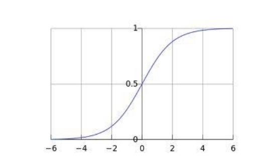

# Lecture 5
## Classification
- **Classification** involves predicting a **categorical** response variable - this is different from regression which involves predicting a numerical response variable
- Attempting to solve classification using regression techniques is not feasible
  - Although the categorical response variable could be encoded into a quantitative variable, a regression model does not fare well since classification targets are *not ordinal* or even comparable 
  - Even in the binary case, a regression line can result in non-sensible values for *y* (which should only take values of 0 or 1)
## Binary Classification
- For two classes, labeled as 0 and 1, the probability can be modeled as two outcomes: $P(y=0 |x)$ and $P(y=1 | x)$
  - $P(y=0|x) = 1 -P(y=1|x)$
    - Given this relationship, there is only a need to model one of the probabilities (e.g. $P(y = 1 |x)$)
  - If $P(y=1|x) > 0.5$, classify the data point into class 1 and otherwise class 0
- In binary classification, the *logistic function* can be used to model the class probability
  - 
  - $\sigma(x) = \frac{1}{1 + e^{-x}}$
- **Logistic Regression** estimates $P(Y = 1)$ by modeling a logistic function
  - $P(Y = 1) = \frac{e^{\beta_0 + \beta_1X}}{1 + e^{\beta_0 + \beta_1X}} = \frac{1}{1+e^{-(\beta_0 + \beta_1X)}}$
    - $\beta_0$ refers to where the *center* value of the logistic curve is (the point where $P(Y) = 0.5$)
    - $\beta_1$ refers to the shape of the curve itself(slope)
  - It can be shown that $\ln(\frac{P(Y=1)}{1 - P(Y=1)}) = \beta_0 + \beta_1X$
    - $\frac{P(Y=1)}{1 - P(Y=1)}$ is the **odds**, and the logistic regression model is known to be the **log-odds** with a linear function of predictors X
      - Increasing X by a single unit results in a $\beta_1$ change in the logg-odds of $Y=1$ or a $e^{\beta_1}$ change in the odds that $Y=1$
      - When $P(Y=1)$, the odds approach infinity (infinite chanceo of Y occurring) and when $P(Y=0)$, the odds are zero (no chance of Y occurring)
## Estimation