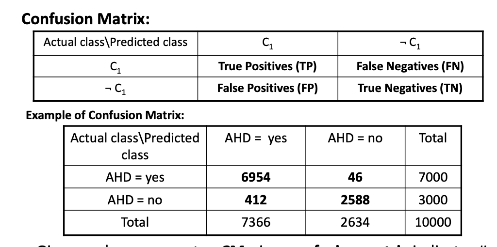
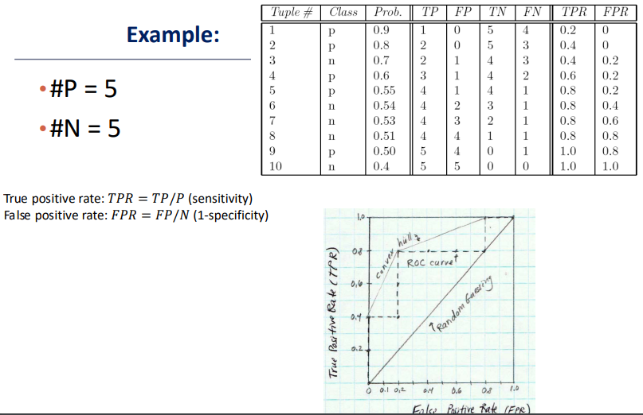
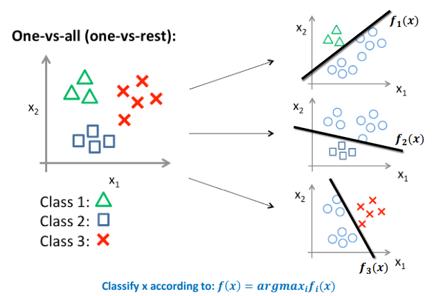
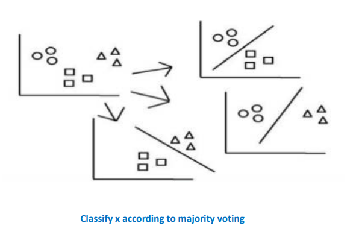

# Lecture 6
## Regularization in Logistic Regression
- Just like in linear regression, *regularization* can be performed for logistic regression
  - $\argmin _ \beta [ - \sum (y_i \ln(p_i) + (1-y_i)\ln(1 - p_i)) + \lambda \sum \beta_j^2]$
  - This will shrink the parameter estimates towards zero
- Choosing $\lambda$ can be done through strategies such as *k-fold* validation
- By regularizing, a logistic regression model could be made much more powerful by introducing more complexity without overfitting as much
  - For instance, a *polynomial* model could be utilized to allow for nonlinear decision boundaries
## Model Evaluation
- There are two types of *error* in binary classification
  - **False Positive**: Incorrectly predicting $\hat{Y} = 1$ when in truth $Y = 0$
  - **False Negative**: Incorrectly predicting $\hat{Y} = 0$ when in truth $Y = 1$
- The results of a classification algorithm can be summarized either via a **confusion matrix** or a **receiver operating characteristics (ROC) curve**
### Confusion Matrix
- 
  - An entry $CM_{i, j}$ indicates the number of tuples in class *i* that were labeled by the classifier as class *j*
- The *threshold* of a classification model can be changed - that is, classification could be based on $\hat{P}(Y = 1) > c$
  - The value of $c$ could be changed accordingly based off of the confusion table
  - Decreasing $c$ allows for more predictions of positives (class 1), which increases the number of *true positives* but also the number of *false positives*
  - Increasing $c$ allows for more predictions of negatives (class 0), which increases the number of *true negatives* but also the number of *false negatives*
  - Which threshold to choose should be based on the context of the data - based on whether false positives or false negatives are more severe 
    - e.g. One would want to avoid false negatives in the context of disease diagnosis 
- **Classifier Accuracy**: $\frac{TP + TN}{ALL}$
- **Error Rate**: $1 - accuracy = \frac{FP + FN}{ALL}$
- **Sensitivity**: True positive recognition rate = $\frac{TP}{P}$
- **Specificity**: True negative recognition rate = $\frac{TN}{N}$
- **Precision**: The percentage of tuples that the classifier labeled as positive that are actually positive
  - $\frac{TP}{TP + FP}$
- **Recall**: The percentage of positive tuples that the classifier labeled as positive
  - $\frac{TP}{TP + FN}$
- There is an inverse relationship between precision and recall
- **F-Measure**: $\frac{2 \times precision \times recall}{precision + recall}$
- **Weighted F Measure**: $\frac{(1 + \beta)^2 \times precision \times recall}{\beta_2 \times precision + recall}$
  - The $\beta$ term is associated with the weight of *recall* - if $\beta = 0$, then the recall does not affect the calculation since $\frac{precision \times recall}{recall} = precision$
### Receiver Operating Characteristics Curves
- An **ROC** curve shows the *trade-off* between the true positive rate and the false positive rate
  - The area under the ROC curve is a measure of the *accuracy* of the model
    - An area of one has perfect accuracy
- An ROC curve can be constructed by ranking the test tuples in decreasing orders (probability), with the ones most likely to belong in the positive class being at the top of the list
  - The vertical axis represents the true positive rate and the horizontal axis represents the false positive rate
    - True Positive Rate: $\frac{TP}{P}$
    - True Negative Rate: $\frac{FP}{N}$
- What is essentially being done is is plotting the false positive and true positive rates for different thresholds in *decreasing order*
- Example:
  - 
  - The first data point has its threshold at $c \geq 0.9$, so *no data points are classified as positive*
    - Since there are no positive classifications, the true positive rate is zero
    - Since there are no positive classifications, the false positive rate is also zero
  - The last data point has its threshold at $c \geq 0.4$, so *all data points are classified as positive*
    - Since all classifications are positive, the true positive rate is one
    - Since all classifications are positive, the false positive rate is also one
  - Intermediate points have their true positive and false positive rates determined and plotted
  - Each time a correct prediction is made, the true positive rate *increases*, so the area under the curve *increases* (more accurate)
- A perfect ROC curve will have perfectly separated data points when sorted (so all positives will come before negatives) - resulting in an area of one since a true positive rate of one is reached before any false positives occur
- A completely random classifier will result in an ROC curve resembling a straight line
  - Intuitively think of this as moving up and then right many times - for a large amount of trials this approaches a line
  - This has an area of $0.5$, which is consistent with the notion of completely guessing
## Multiclass and Multilabel Classification
- For multiclass classification, each data point can only belong to *one class* 
- For multilabel classification, each data point can belong to *multiple classes*; this can be considered as a *set of binary classification problems*
- **One vs All**: If there are *m* classes, then *m* classifiers can be trained (one for each class)
  - Each classifier *j* treats tuples in class *j* as positive and all others as negative
  - Choose the classifier with the maximum value over all to assign the class
  - 
- **All vs All**: Given *m* classes, construct $\frac{m(m-1)}{2}$ binary classifiers
  - Take the *votes* over all the classifiers and pick the class with the maximum vote
  - This approach typically performs better, but is more expensive to train
  - 
## Practical Issues
- **Class-Imbalance Problem**: Rare positive examples but numerous negative ones (e.g. medical conditions)
  - Traditional classification approaches assume a *balanced distribution of classes* - many are not suitable for class-imbalanced data
  - Classifiers could achieve large accuracy by simply classifying to the more frequent class - but this is not *practical*
    - Some ways to address this issue could involve **oversampling** (re-sampling data from minority class), **undersampling** (eliminating tuples randomly from majority class), or **synthesizing new data points**