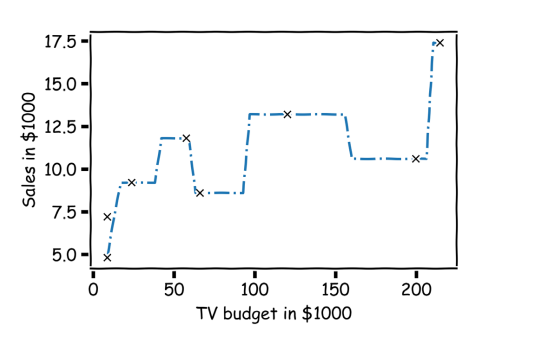
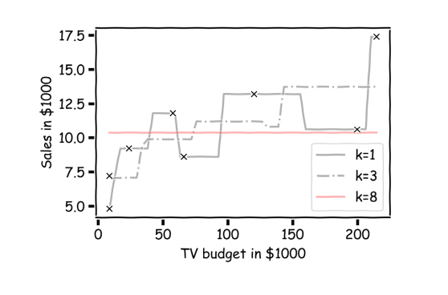

# Lecture 7
## True versus Statistical Model
- Assume that the response variable $Y$ relates to the predictors $X$ through some unknown function $f$
    - $Y = f(X) + \epsilon$
    - There is a random amount of noise unrelated to $X$ that results in $Y$ differing from $f(X)$
- A statistical model is any algorithm that *estimates f*, producing $\hat{f}$
- In linear regression, $f(X)$ is a *linear* function of predictors
    - There can, however, be *other forms of $f$*
    - As a matter of fact, $f$ does not necessarily need to be defined *explicitly* - K-Nearest Neighbors results in this type of implicitly defined model
- In some contexts, its important to obtain $\hat{f}$, which is the *estimate* of $f$
    - In other contexts, it is important to use a set of measurements $X_i = (x_{i, 1}, ..., x_{i, p})$ to *predict* a value for the response variable $\hat{y_i}$
## Nearest Neighbors
- A nearest neighbors approach predicts a value by looking for the *nearest* data point and using that neighbor's value as the predicted value
- Example:
    - 
    - 
        - For K-Nearest Neighbors, the *average* of the K-nearest neighbor values are taken 
            - This is not a weighted average - all *k* of the neighbors are treated equally
- Regression:
    - $\hat{y_n} = \frac{1}{k}\sum^k y_{n_i}$
    - ${x_{n1}, ..., x_{nk}}$ are the $k$ observations that are most similar to $x_n$ (e.g. similarity based on a distance metric)
- Classification:
    - Instead of taking the *average* value of the response variable, classification is done according to the majority class of the $k$ nearest neighbors
## Multiple Predictors
- If there are *multiple predictors*, then it is necessary to define a measure of distance for observations that effectively quantifies similarity between observations
    - Typically Euclidian distance is used
- It is good practice to account for differences in variability among predictors (features) by performing standardization
## Choice of k
- Too *small* of a $k$ results in a very unstable, bumpy curve - this results in high sensitivity to noise
- Too *large* of a $k$ (e.g. $k=n$) results in a curve that resembles the *average* of the dataset - this results in constant predictions
- The best value of $k$ should be determined via techniques such as k-fold cross validation