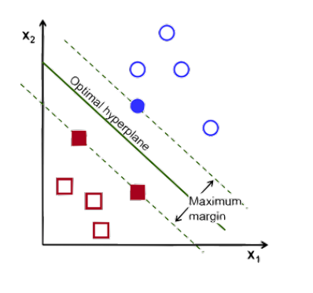

# Lecture 8
## Introduction
- In logistic regression, a *decision boundary* that separates the training classes in feature space is learned
- When data can be perfectly separated by a linear boundary, the data is considered **linearly separable**
- It may be the case, for linearly separable data, though, that *multiple decision boundaries can fit the data*
    - 
- The **support vector machine** algorithm tries to find the boundary that *maximizes* the margin between the two classes
    - 
## Math Review
- Hyperplane:
    - $a_1 x_1 + a_2 x_2 + ... + a_n x_n = c$
    - $n = (a_1, a_2, ..., a_n)$
        - This is the vector that is *perpendicular* to the surface of the hyperplane
    - Given a normal $(a, b, c)$ and a point $(x_0, y_0, z_0)$:
        - $(a, b, c) \cdot (x_0 - x, y_0 - y, z_0 - z ) = 0$
    - Distance from a point $(x_0, y_0, z_0)$ to plane $ax + by + cz = d$:
        - $|(x_0 - x, y_0 - y, z_0 -z) \cdot \frac{(a, b, c)}{||(a, b, c)||}| = \frac{|ax_0 + by_0 + cz_0 - d|}{\sqrt{a^2 + b^2 + c^2}}$
        - If $(x_0, y_0, z_0)$ is on the same side as the normal vector, then $n \cdot (x_0, y_0, z_0) - d> 0$
## Classifying Linearly Separable Data
- A *linear boundary* is defined by a hyperplane: $\bold{w}^Tx + b = 0$
    - $\bold{w} = {w_1, w_2, ..., w_p}$
    - $b$ is a scalar    
- With this, classification involves determining if:
    - $w_0 + w_1 x + w_2 x_2 + ... > 0$
        - Classify $y_i = 1$
    - $w_0 + w_1 x + w_2 x_2 + ... \leq 0$
        - Classify $y_i = -1$
- The distance between any point and the distance boundary can be expressed as:
    - $D(x) = \frac{\bold{w}^Tx + b}{||\bold{w}||}$
- The points closest to the decision boundary are called the *support vectors*
    - The margin is *twice* the distance of the boundary to its support vectors
- The goal of the support vector machine algorithm is to search for a hyperplane with the *largest margin* 
- For any plane $\bold{w}^Tx + b = 0$, scaling can be done such that the support vectors lie on the planes $\bold{w}^Tx + b = \pm1$ - this simplifies calculation for the margin as just $\frac{2}{||\bold{w}||}$
    - 
        - Since $\bold{w}^Tx + b = \pm 1$, the distance from each support vector is just $\frac{1}{||w||}$
- The optimization problem involves finding $\bold{w}$ and $b$ such that $p = \frac{2}{||w||}$ subject to the constraints:
    - $\bold{w}^Tx_i + b \geq 1$ if $y_i = 1$
    - $\bold{w}^Tx_i + b \leq -1$ if $y_i = -1$
- In more formal terms, the object is to find $\bold{w}$ and $b$ such that $\Phi(w) = \frac{1}{2}\bold{w}^T\bold{w}$ is minimized given the constraints: For all $(x_i, y_i): y_i(\bold{w}^Tx_i + b) \geq 1$
    - Since this is now a *quadratic function* subject to *linear constraints*, a solution can be found via **Lagrange multipliers**, where a multiplier $\alpha_i$ is associated with every constraint (data point) in the primary problem
    - The solution is of the form $\bold{w} = \sum \alpha_i y_i x_i$ and $b = y_k - \bold{w}^Tx_k$ for any $x_k$ such that $\alpha_k \neq 0$
        - Each non-zero $\alpha_i$ indicates that its corresponding $x_i$ is a *support vector* (i.e., it lies on the parallel hyperplane to the solution)
        - The classifying function is of the form $f(x) = \sum \alpha_i y_i x_i^T x + b$
            - Notice that there is an *inner product* between the test point $x$ and its support vectors $x_i$
- Example: Consider that the SVM optimization algorithm returns three support vectors: $(1, 1): + , (2,0): +, (-1, -1): -$
    - A line can be constructed from the positive support vectors, giving $x_1 + x_2 = 2 \rightarrow x_1 + x_2 - 1 =1$ 
    - With this line, the negative support vector's line can be constructed - note that this will be *parallel* to the positive line: $x_1 + x_2 = -2 \rightarrow x_1 + x_2 + 1 = -1$
    - The boundary should be *in between* these two lines, which will result in $\frac{2x_1+2x_2+0=0}{2}\rightarrow x_1 + x_2 = 0$
## Classifying Linearly Non-Separable Data
- Maximizing the margin is a good idea as long as we assume that the underlying classes are linearly separable and the data is noise free
- If the data is noisy, however, generalizability might be sacrificed in order to minimize classification error with a very narrow margin
    - It might be better to allow for some error to allow for a model to generalize better
- With **soft margin**, error should be expressed as a function of the distance to the decision boundary - the closer the misclassified point is to the decision boundary, the better
- Two types of errors can be penalized:
    - **Margin Violation**: The points are on the correct side of the boundary but are *inside the margin*, which means they have distance $\frac{\xi}{||w||}$, where $0 < \xi < 1$
    - **Misclassification**: the points are on the wrong side of the boundary and have a distance $\frac{\xi}{||w||}$, where $\xi > 1$
    - A positive value of $\xi_n$ quantifies the error on a point $x_n$
    - 
        - Note that $\xi$ is relative to the *margin* **not** *decision boundary*
        - Support vectors are those with *positive* $\alpha_i$ and $\xi_i = 0$ (on the dashed line)
- The error terms of $\xi_n$ can be incorporated into the optimization problem via:
    - $\min_{\xi_n \in R^+, w, b} ||w||^2 + \lambda \sum \xi_n$ such that $y_n(w^Tx_n + b) \geq 1 - \xi_n$ for each $n$
        - The goal is to keep $\xi_n$ as close to zero as possible, as this resembles the linearly separable case
        - If $\xi_n$ is positive (there is error), the decision boundary should *shift* by the amount of error ($\xi_n$) to account for this, hence it being added to the constraint  
        - The hyperparameter $\lambda$ controls how *hard* the margin is
            - Too small of a $\lambda$ penalizes errors less and hence the classifier will have a very large margin
            - Too large of a $\lambda$ penalizes errors more and hence the classifier will accept *narrow* margins (more hard margin)
- Soft margin can be viewed as *hinge loss* with regularization terms
    - $\Phi(w) = \frac{1}{2}w^Tw + \lambda \sum \xi_i$
    - $\Phi(w) = \frac{1}{2}w^Tw + \lambda \sum \max(0, 1- y_i(w^Tx_i + b))$
        - This is essentially penalizing points that are within the margin or far out from it
        - A point on the *correct* side of the margin will have a large negative $1 - y_i(w^Tx_i + b)$, so the $\max$ will evaluate to zero
        - A point on the *wrong* side of the margin (or within the margin itself) will a large positive $y_i(w^Tx_i + b)$, so the $\max$ will evaluate to a large positive value
    - The $\frac{1}{2}w^Tw$ can be viewed as L2 regularization
    - 
- Classification be done by computing a score $w^Tx + b = \sum \alpha_i y_i x_i^T x + b$ can deciding the class based on the sign
## Non-Linear SVMs
- For datasets that are *not linearly separable*, it may be necessary to perform some sort of mapping
- One kind of mapping can involve mapping the data to a higher-dimensional space where it *can* be linearly separated
    - 
- A **kernel function** is some function that corresponds to an inner product in some expanded feature space
    - Recall that since the linear classifier relies on an inner product between vectors $x_i^T x_j$, a *kernel* can express this inner product between two mapped vectors
    - $\Theta: x \rightarrow \phi(x)$
    - $K(x_i, x_j) = \phi(x_i)^T \phi(x_j)$
- Rather than find the mappings themselves, different types of *kernel functions* are used
- Common kernel functions:
    - **Polynomial**: $K(X_i, X_j) = (X_i \cdot X_j +1)^h$
    - **Gaussian Radial Basis**: $K(X_i, X_j) = e^{-|||X_i - X_j||^2 / 2\sigma^2}$
    - **Sigmoid**: $K(X_i, X_j) = \tanh(kX_i \cdot X_j - \delta)$
- With kernels, the decision boundary is:
    - $w^Tx + b = \sum \alpha y_n K(x_n x) + b$
    - $\hat{y} = sign(w^Tx + b)$
        - It may be necessary to apply the kernel function on $x$