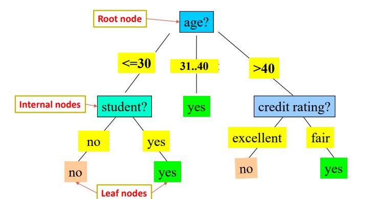
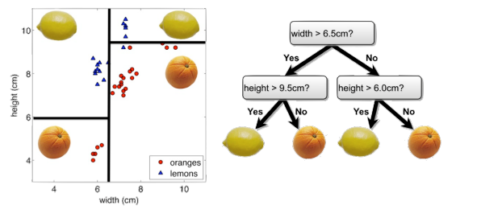
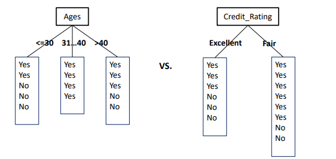
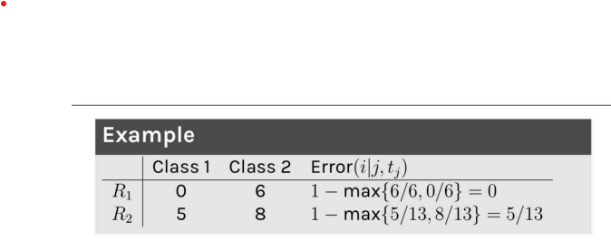
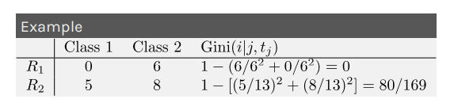
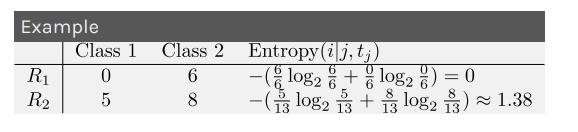

# Lecture 9
## Motivation
- Recall that, with logistic regression, the *decision boundary* is defined where the probability of being in class 0 and class 1 are equal
    - The boundary with logistic regression is a *hyperplane*
- Decision boundaries can be generalized to higher order polynomial terms, but even these may not be powerful enough to handle complex decision boundaries 
## Decision Trees
- Decision trees partition the data into *different regions* and make predictions
- 
    - The final outcome is based on a series of comparisons of the values of predictors against threshold values
    - The *root* and *internal* nodes of the tree represent attribute testing
    - *Branching* is determined by attribute value
    - *Terminal leafs* represent class assignments
- Every flow chart tree corresponds to a partition of the feature space by **axis-aligned lines or (hyper) planes**
    - 
    - Each comparison and branching results in splitting a region in the feature space on a *single feature*
## Learning the Model
- Learning a decision tree for binary classification involves producing an *optimal* partition of the feature space with axis-aligned linear boundaries
    - Each region is predicted to have a class label based on the *largest class* of training points in that region when performing prediction
- A reasonable model can be found using a *greedy algorithm*:
    - Start with an empty decision tree
    - Choose the optimal predictor (feature) on which to split and choose the optimal threshold value for splitting
        - For numerical variables, a threshold can be used to partition the data
        - For categorical variables, the possible value can be used to partition the data
    - Recurse on each new node until the stopping condition is met
        - The stopping condition should be defined
### Splitting Criteria
- The regions in the feature space should grow progressively more "pure" with the number of splits - each region should specialize towards a single class
    - Example: 
        - 
        - The left attribute (ages) is better for splitting as it produces more *pure* regions
- There are various ways to define the "purity" of a region:
    - **Classification Error**: Consider  *J* predictors and *K* classes, and the $j^{th}$ predictor is selected, splitting a region containing $N$ training points along the threshold $t_j$
        - The **classification error** made by each newly created region $R_1$, $R_2$ as: $Error(i | j, t_j) = 1 - \max_k p(k|R_i)$
            -  $p(k|R_i)$ is the percentage of data points belonging to the $k^{th}$ class given that they are in region $R_i$
            - This is essentially majority voting - the more data points of the same class in a given region, the lower the error
        - For each region, the classification error can be computed and then the *average classification error* can be found
        - The goal is find the predictor $j$ and threshold $t_j$ that minimizes the *average classification error* over the regions, weighted by the population of the regions:
            - $\min_{j, t_j} [ \frac{N_1}{N} Error(1| j, t_j) + \frac{N_2}{N} Error(2| j, t_j)] $
        - Example:
            - 
    - **Gini Index**: Consider  *J* predictors and *K* classes, and the $j^{th}$ predictor is selected, splitting a region containing $N$ training points along the threshold $t_j$
        - The **Gini Index** measures the purity of each region by the term: $Gini(i | i ,t_j) = 1 - \sum_k p(k | R_i)^2$
            - Without the quadratic term, the summation would yield *1*, so the index would always yield zero
        - The goal is find the predictor $j$ and threshold $t_j$ that minimizes the *average Gini index* over the regions, weighted by the population of the regions:
            - $\min_{j, t_j} [ \frac{N_1}{N} Gini(1| j, t_j) + \frac{N_2}{N} Gini(2| j, t_j)] $
        - 
    - **Entropy** The strength of a signal in a particular region can be quantified by computing its *entropy*
        - $H(X)= - \sum p(x) log_2 p(x)$
        - The entropy is zero when the region is very pure (all in one class) and is high (one) when values are less pure (unpredictable) - e.g. when the probability is 0.5
        - The entropy can also be averaged:
            - $\min_{j, t_j} [ \frac{N_1}{N} Entropy(1| j, t_j) + \frac{N_2}{N} Entropy(2| j, t_j)]$
        - Example: 
            - 
- Splitting should also not yield empty regions
### Stopping Criteria
- If the decision tree learning algorithm is not terminated manually, the tree will continue to grow until each region defined by the model possibly contains exactly *one training point*
    - This will result in a 100% training accuracy, which is a clear sign of overfitting (it will not generalize well)
- Stopping based on depth:
    - Small Depth:
        - There is *high bias*, as the model is unable to capture the nonlinear boundary separating two classes 
        - However, there is a *low variance*, as the model is robust to slight pertubations in the training data
    - High Depth:
        - There is *low bias*, as the model is sufficiently complex enough to classify points on the boundary (e.g. by zig-zagging)
        - There is, however, a *high variance*, as the model is sensitive to pertubations in the training data
- Common Conditions:
    - Do not split a region if all instances in the region belong to the *same class*
    - Do not split a region if the number of instances in the region will fall below a pre-defined threshold
    - Do not split a region if the total number of leaves in the tree will exceed a pre-defined threshold
- Cross-validation can be used to find appropriate thresholds